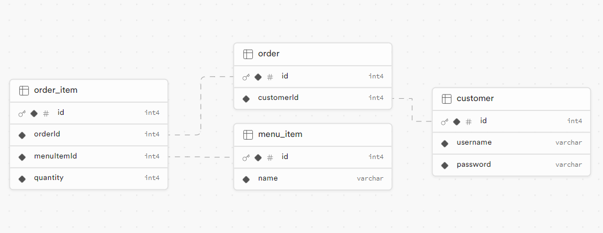

# API Documentation

## Overview

This document provides detailed information about the endpoints and functionality of the API server built using IBM LoopBack 3.
The API server is dedicated to facilitating the ordering of menu items from a restaurant's menu. Customers can utilize this API to browse the available menu options and place orders directly through the system.

### Postman Documentation

[restaurant](https://documenter.getpostman.com/view/30790473/2sA3Bn5roz)

## Prerequisites

Before using the API server, ensure that you have:

1. **Node.js and npm**: Make sure you have Node.js version 16.20.2 and npm version 8.19.4 installed on your system. You can download Node.js from [Node.js official website](https://nodejs.org/en/download).

2. **IBM LoopBack 3**: The API server is built using IBM LoopBack 3. Familiarize yourself with LoopBack 3 documentation for better understanding.

## Authentication

The API server uses a bearer token authentication mechanism to secure endpoints. Clients are required to include a valid JWT (JSON Web Token) in the `Authorization` header of their requests.
<br>
below how server get authentication
```javascript
const jwt = require('jsonwebtoken');
const jwtKey = process.env.JWT_SECRET;
module.exports = {
  getToken: function(req) {
    const authHeader = req.headers.authorization;

    if (!authHeader) {
      return null;
    }
    const token = authHeader.split(' ')[1];
    try {
      const decoded = jwt.verify(token, jwtKey);
      return decoded;
    } catch (error) {
      return null;
    }
  },
  loggedUser: function(decodedToken) {
    return {
      userId: decodedToken.userId,
    };
  },
};
```
##### Token Generation

When a user successfully logs in, the API server generates a JWT token and returns it to the client. This token should be securely stored by the client and included in subsequent API requests to authenticate the user.

## Endpoints

|                       | Method | Patch                       | Auth | Req.body                                   |
| --------------------- | ------ | --------------------------- | ---- | ------------------------------------------ |
| Customer registration | POST   | *baseUrl*/api/auth/register | no   | username: string, password: string         |
| Customer login        | POST   | *baseUrl*/api/auth/login    | no   | username: string, password: string         |
| Customer profile      | GET    | *baseUrl*/api/user          | yes  | -                                          |
| Customer update       | PUT    | *baseUrl*/api/user          | yes  | username: string, password: string         |
| Delete account        | DELETE | *baseUrl*/api/user/delete   | yes  | -                                          |
| Create order          | POST   | *baseUrl*/api/order         | yes  | menuItemId: number[ ], quantity: number[ ] |
| Get Customer's order  | GET    | *baseUrl*/api/order         | yes  | -                                          |
| Update order          | PUT    | *baseUrl*/api/order/:id     | yes  | menuItemId: number[ ], quantity: number[ ] |
| Delete order          | DELETE | *baseUrl*/api/order/:id     | yes  | -                                          |

## Data Base and Models

Database schema visualizer :



Example Model:

```json
{
    "name": "Order",
    "base": "PersistedModel",
    "properties": {
        "customerId": {
            "type": "number",
            "required": true,
            "postgresql": {
                "columnName": "customerId"
            }
        }
    },
    "relations": {
        "customer": {
            "type": "belongsTo",
            "model": "Customer",
            "foreignKey": "customerId"
        }
    }
}
```

## Tutorial: Using the API and Run unit test

Follow these steps to use the API server:

- **Clone the Repository**: Clone the API server repository from GitHub to your local machine.
  
  ```bash
  git clone https://github.com/RPrasetyoB/loopback3.git
  ```

- **Install Dependencies**: Navigate to the cloned directory and install the necessary dependencies using npm.
  
  ```bash
  cd loopback3
  npm install
  ```

- **Set Up Environment Variables**: As the `.env` file is included in the repository for testing purposes, you don't need to set up environment variables manually.

- **Run the Server**: Start the API server locally using the following command:
  
  ```bash
  npm start
  ```

Run unit testing with command as follow:

```bash
npm run test
```
